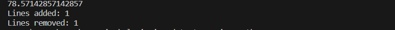

# CodeClause_Plagiarism_detector_using_python_Task1
Plagiarism checker using Python , this is allowcated project by [Codeclause](https://codeclause.com/) 

Author: Rohan Kadam

Github: https://github.com/KRohancoder

# Discription 📀
In this Project, we are going to learn how to check plagiarism using Python.

Plagiarism: Plagiarism basically refers to cheating. It means stealing someone’s else work, ideas, or information from the resources without providing the necessary credits to the author. For example, copying text from different resources from word to word without mentioning any quotation marks.

# Project Difficulty level 🥇
Beginner

# Programming Language 🐍
Python

# Domain 🏥
Application

# Tools 🛠
This project requires that you have Python installed. Download it here.

It also requires the following Python packages, which can be installed via pip:

-Difflab
-SequenceMatcher 

Then run it by double clicking on player.py!

# Features !

- You can copy paste data in text file
- You will get percentage of Plagiarism result
- You will able to see number of added and removed lines.

# Editor's Interface Screenshot

=======================================================================

## 📌 Opensource Programs

### [This project is a part of following Open Source Program](https://codeclause.com/)

